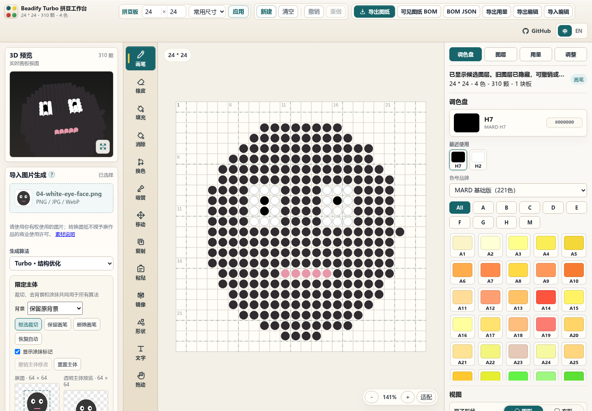

# Beadify Turbo 使用教程

打开已部署的网站即可使用；自行安装见 [部署教程](lite-deployment.md)。图片和图纸在当前浏览器处理，无需注册账号。

截图使用本仓库原创的 `04-white-eye-face` 合成测试图，示范 24 × 24、最多 8 色的结构优化结果；不代表真实照片质量验收。

## 1. 做出第一张图纸

1. 准备一张自己有权使用的 PNG、JPEG 或 WebP。首次建议用背景简单、主体明确、尺寸不太大的图片。
2. 在左侧图片区域点击上传。先用默认的“原版算法”建立对照，再尝试“Turbo · 结构优化”。
3. 设置宽、高和色数，例如 **40 × 40、12 色**。这只是便于入门的起点；原图宽高比会保留，不足的位置为空格。
4. 等待生成候选。调整参数后会重新预览；也可以点“生成预览”。生成进度条显示处理阶段，可取消当前生成。
5. 查看候选细节与用量，满意后点击“接受为新图层”。新层显示，原有层保留并隐藏；未接受的候选不会直接覆盖已经编辑的图纸。
6. 用画笔、填充和擦除修补，点击顶部“导出编辑”保存项目 JSON。需要制作时再导出图纸和用量表。

先保存项目，再尝试不同算法或局部优化，便于回到自己满意的结果。

## 2. 裁切主体、去背景与白边

上传后使用左侧主体编辑器，在原图上拖框或输入裁切坐标。主体裁切会影响下一次生成，不是对已完成图层的橡皮擦操作。

- **保留原背景：** 不自动去除背景，适合像素画、透明图或主体与背景颜色很接近的图片。
- **去除边界连通背景：** 从边缘识别相近背景，用容差控制范围。调大容差可能影响贴近背景的主体细节，需查看预览。
- **保留/删除画笔：** 修补眼白、链条、尾巴等细小区域。画笔大小按原图像素计算，可显示涂抹标记并撤销主体调整。
- **裁切白色边框：** 只收紧外围连续的白行/白列，不删除框内白色细节。先从容差 0 尝试，有压缩噪声时小幅增加；不满意可撤销。

“重置主体”会清除该次主体设置。主体编辑依靠原图像素、连通区域和手工修正，不是语义抠图。

## 3. 选择算法、尺寸与颜色

| 算法 | 适合的起点 | 需要观察的地方 |
|---|---|---|
| 原版算法 | 建立上游结果对照、熟悉原编辑器的用户 | 保留原有处理风格，也是默认选择 |
| 最近邻 | 原图已是像素画，或需要观察直接采样结果 | 缩小后的小细节可能落在采样点之间 |
| 面积采样 | 希望得到稳定的区域平均结果 | 少量像素的细线可能与背景混合 |
| 主导色采样 | 色块明确的图案 | 区域主色可能压过小特征 |
| 结构优化 | 希望在固定格数和色数内保留部件、线条及关键色 | 较慢，仍需比较候选；不是所有图片都更好 |

“图纸风格”提供简洁色块、保留色阶、像素画和“原图已是像素画”。最后一种会绕过去纹理，不执行文字增强。不同算法不支持的选项会禁用。

**尺寸：** 图纸越大，一般越有空间表现细节，也需要更多豆子和计算。先从 40–50 格尝试，确有需要再增加。主体太小应先裁切，单纯加色数不会增加格子空间。

**色数：** 色数是上限，不是必须用满的数量。基础色卡 221 色、完整色卡 291 色；可输入数值或点“使用全部221色/291色”。可用色数多，也不意味着每种颜色都会出现在结果中。

在“色卡与重算选项”中：

- “仅使用这些色号”可输入如 `A1, H2, H7`，留空使用所选色卡。
- “成品必须包含”用于结构优化，不能与仅允许的颜色或总色数上限矛盾。
- “参考原图边缘细节”、采样策略和近似对称会改变候选。对称默认关闭，非对称图案不应为了平滑而强行开启。
- “结构优化高级选项”可以调整搜索预算和证据权重。先保存一个基准项目，一次改一类参数，便于比较实际变化。

色卡 RGB 为上游近似值，屏幕显示不等于实体豆颜色；制作前按自己的实物色卡核对。

## 4. 比较网格与保留小细节

同一条细线落在不同采样网格位置，结果可能明显不同。在支持的算法下点“比较网格位置”，查看居中及上下左右的候选，再选择并接受。移动网格属于重新采样，不是平移已编辑图层。

当眼睛、高光、嘴、标记等特征容易消失时：

1. 展开“标记原图细节”，框出对应部件。
2. 填写特征名称、可接受色号及最少保留格数；留空色号时使用当前选中色。
3. 需要只有一颗豆的小特征时勾选“允许单颗细节”。
4. 点击“添加原图特征”，使用结构优化重新生成并观察候选。

这些标记来自原图坐标，与成品网格上的选区不同。过小的输出尺寸、过紧的色数和相互冲突的要求仍可能无法满足；出现约束错误时应调整要求，不能把任意结果当作已经保留了细节。

## 5. 图层、手工编辑与局部重算

接受候选后，使用现有的画笔、填充、擦除、撤销和重做。图层的可见性影响最终图纸：叠在同一个位置时取最上层可见的豆子，隐藏层不计入最终用量。

需要只调整一部分时展开“选区重算与保护”：

1. 在成品图纸中拖出选区，或填写选区坐标。
2. 选择“原图细节重算”或“整理当前图纸”。前者需要项目已有原图结构缓存；后者只根据当前图纸处理。
3. 按需要设置“锁定原色”“锁定空格”“保护细节”“简化色块”或“强化选中色”。细节保留规则可指定可接受颜色、最少格数和单颗细节。
4. 点击“重算选区”，比较并接受结果。选区外的格子会被锁住。
5. 不再需要约束时点击“清除选区规则”。

约束作用于算法，手工画笔仍然可以修改格子。若手改后希望新颜色固定，重新设置锁。色数上限小于必须保留的颜色数、锁定颜色不在允许列表等情况会报错，应先解除矛盾。

原图结构缓存随项目保存。没有重新选择原图时，仍可编辑、导出和使用已有缓存；需要重新裁切或重新采样时，应再次选择匹配的原文件。

## 6. 手工文字标注、原字形增强与重新排字

这一部分全部使用手工输入和 CPU 图像处理，不会自动识字。

**保留原字形：**

1. 在“手工文字标注”选择“拖动框选文字区域”，框住文字，保留少量周边背景。
2. 选中该区域，手动输入或校正内容。区域可分类为文字、标志、水印、图案或不确定；分类不赋予删除或使用该内容的权利。
3. 必要时切换为笔画、背景、描边或阴影画笔。紫色表示笔画，绿色表示背景；先选区域再涂，注意区分笔画与背景。
4. 点击“比较普通与文字增强”。查看两份候选，满意后接受。仅输入转写内容不会凭空恢复原图已经没有的细节。

**重新排字：**

1. 先建立文字区域，再展开“重新排字”。
2. 输入内容（支持换行），选择字体、加粗、对齐和文字色。
3. 背景默认衔接周围背景，也可选择区域底色。
4. 点击“生成重新排字候选”，在普通、原字形增强和重新排字之间比较，再接受为新图层。

重新排字保留原区域位置并自动适配字号，使用访问设备可用的字体。不同系统的字体显示可能不同；小字号、缺字或复杂背景仍可能不理想。重排会改变原字形风格，需要保留手写风格时优先比较原字形增强。

文字记录可以单独导入/导出 JSON。记录按原图 RGBA 内容校验，换一张图片时不会直接套用旧记录。历史项目中的结构化分析记录也会保留。

## 7. 保存项目与导出制作文件

| 目的 | 操作/格式 | 内容 |
|---|---|---|
| 以后继续编辑 | “导出编辑”，项目 JSON | 图层、色卡快照、参数、缓存、约束、手工文字记录等 |
| 恢复项目 | “导入编辑”，选择项目 JSON | 恢复图纸；进一步处理原图时重新选择匹配文件 |
| 分享预览 | PNG / SVG | 最终可见图纸；SVG 可用于矢量查看 |
| 打印制作 | PDF 或打印图纸 | A4/Letter、镜像、分页重叠、毫米间距等设置 |
| 采购/核对数量 | 可见图纸 BOM、BOM JSON、用量 Excel | 按最终可见格子统计色号及数量 |

浏览器会保存草稿，但清理站点数据、更换浏览器或切换域名/端口可能使原草稿无法访问。**项目 JSON 是自己的备份。** 原始图片文件不嵌入项目，请同时保留原图。存储不足时程序会提示省略可重建缓存或单独导出文字记录；遇到保存失败应立即导出项目。

打印时选择 **100% / 实际大小**，关闭打印机的自动适应页面，先核对 50 毫米校准尺和豆板间距。PDF 可以分页，但仍需要真实打印确认尺寸；屏幕预览通过不等于实物拼装已经验证。

## 8. 常见问题

| 现象 | 处理方式 |
|---|---|
| 颜色没有达到设置数量 | 设置的是上限，算法不强制用满；检查是否限制了可用色号 |
| 小嘴、眼白或细线丢失 | 先裁切扩大主体占比，再比较网格位置、增加格数或手工标记细节；适当放宽色数 |
| 背景去多了 | 降低背景容差，用保留画笔修正，或切换保留原背景 |
| 生成较慢 | 缩小原图、减少目标格数/搜索预算，或先用面积采样；计算在访问者设备，升级静态服务器不会直接加速算法 |
| 新候选没显示在最终图纸 | 点击“接受为新图层”，并检查图层可见性 |
| 导出数量与自己数的图层总数不同 | 导出按最终可见合成图计数，不累加隐藏层或被上层覆盖的豆子 |
| 文字增强不可用 | 检查是否有匹配的原图和手工区域，是否选择了“原图已是像素画”模式 |
| 导入文字记录被拒绝 | 使用匹配原图，保持原文件内容；不要手改记录 hash 绕过校验 |
| 重新排字缺字 | 换用设备已安装且覆盖该文字的字体，或用原字形/手工画笔处理 |
| 无法直接打开本地 HTML | 用包内 Node 服务或其它 HTTP(S) 服务器；Worker 需要网页服务环境 |

支持的输入上限为 20 MiB、约 4 MP、单边 4096；核心目标单边上限 256 格。大图和高格数可能显著增加浏览器内存及时间。问题反馈请优先附原创小样、算法/尺寸/色数、浏览器版本和可公开的项目文件，避免提交无权公开的图片。

[回到首页](../README.md) · [部署教程](lite-deployment.md) · [具体改进](improvements.md) · [素材权利](../USAGE_RIGHTS.md)
